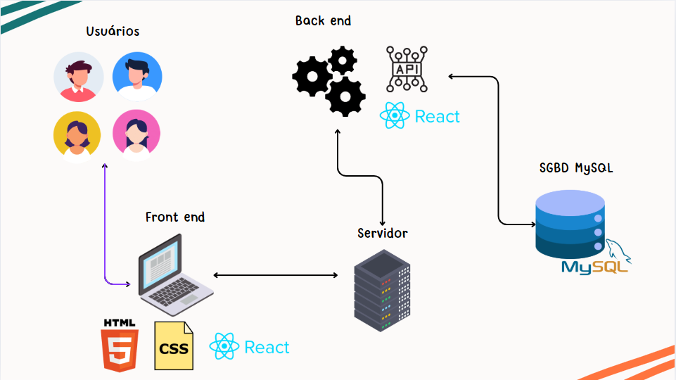
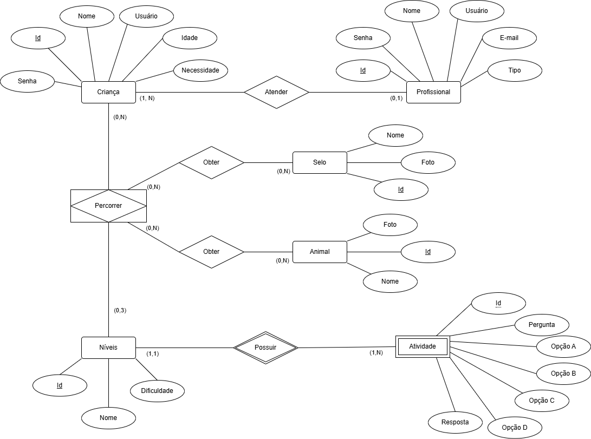
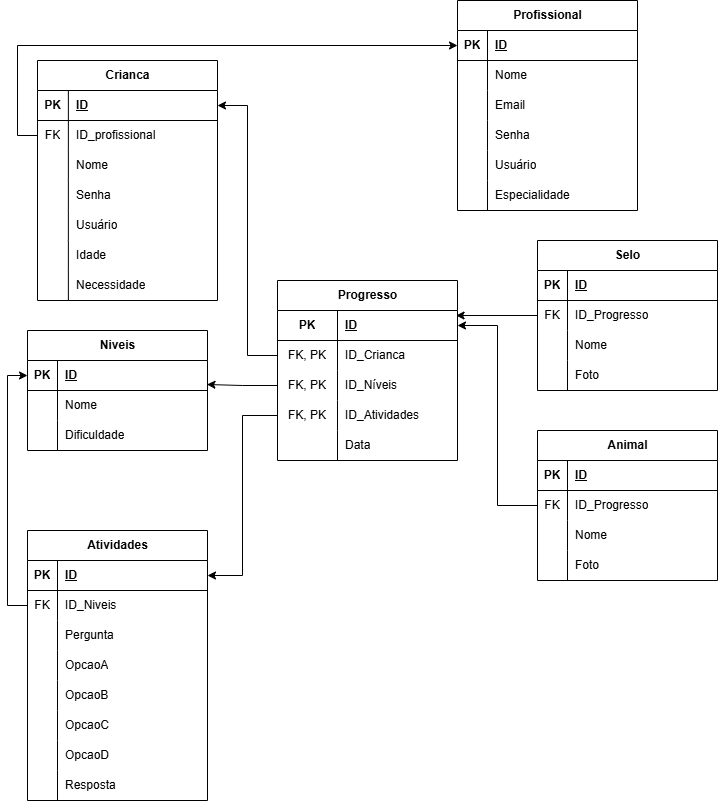
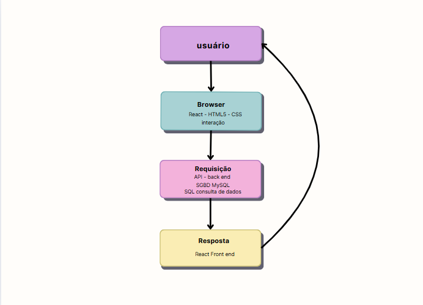

## 4. Projeto da Solução

Pré-requisitos: <a href="3-Especificação.md"> Especificação do Projeto (Requisitos do Software) </a>

## 4.1. Arquitetura da solução

O usuário acessa via navegador pela WEB a página de acesso da aplicação, a aplicação acessa o servidor que faze uma conexão via API com o banco de dados MySQL que retorna para API com os dados de leitura ou gravação, a API retorna para o servidor, o mesmo que retorna para os usuário que estão conectados através do navegador.
 
 **Diagrama de Arquitetura**:
 
 
 
 >FONTE: https://www.researchgate.net/figure/Figura-2-Diagrama-de-arquitectura-del-sistema_fig1_361400461 
 

### 4.2. Wireframes/Mockups de telas

Link Prototipo: https://www.figma.com/design/6XlrwMVRBARnI8rGhep71O/NeuroPlay?node-id=1-2&p=f

### 4.3. Modelo de dados

(colocar uma descrição aqui) O desenvolvimento da solução proposta requer a existência de bases de dados que permitam efetuar os cadastros de dados e controles associados aos processos identificados, assim como recuperações.
Utilizando a notação do DER (Diagrama Entidade e Relacionamento), elaborem um modelo, na ferramenta visual indicada na disciplina, que contemple todas as entidades e atributos associados às atividades dos processos identificados. Deve ser gerado um único DER que suporte todos os processos escolhidos, visando, assim, uma base de dados integrada. O modelo deve contemplar, também, o controle de acesso de usuários (partes interessadas dos processos) de acordo com os papéis definidos nos modelos do processo de negócio.
_Apresente o modelo de dados por meio de um modelo relacional que contemple todos os conceitos e atributos apresentados na modelagem dos processos._

#### 4.3.1 Modelo ER

#### 4.3.2 Esquema Relacional

---

#### 4.3.3 Modelo Físico

Insira aqui o script de criação das tabelas do banco de dados. 
**OBS:** Se o aluno utilizar BD NoSQL, ele derá incluir o script aqui também. 

Veja um exemplo:

<code>

 -- Criação da tabela Médico
CREATE TABLE Medico (
    MedCodigo INTEGER PRIMARY KEY,
    MedNome VARCHAR(100)
);

-- Criação da tabela Paciente
CREATE TABLE Paciente (
    PacCodigo INTEGER PRIMARY KEY,
    PacNome VARCHAR(100)
);

-- Criação da tabela Consulta
CREATE TABLE Consulta (
    ConCodigo INTEGER PRIMARY KEY,
    MedCodigo INTEGER,
    PacCodigo INTEGER,
    Data DATE,
    FOREIGN KEY (MedCodigo) REFERENCES Medico(MedCodigo),
    FOREIGN KEY (PacCodigo) REFERENCES Paciente(PacCodigo)
);

-- Criação da tabela Medicamento
CREATE TABLE Medicamento (
    MdcCodigo INTEGER PRIMARY KEY,
    MdcNome VARCHAR(100)
);

-- Criação da tabela Prescricao
CREATE TABLE Prescricao (
    ConCodigo INTEGER,
    MdcCodigo INTEGER,
    Posologia VARCHAR(200),
    PRIMARY KEY (ConCodigo, MdcCodigo),
    FOREIGN KEY (ConCodigo) REFERENCES Consulta(ConCodigo),
    FOREIGN KEY (MdcCodigo) REFERENCES Medicamento(MdcCodigo)
);

</code>

**Este script deverá ser incluído em um arquivo .sql na pasta src\bd.**

### 4.4. Tecnologias

As tecnologias selecionadas visam atender à necessidade de rápida implementação da solução, priorizando aquelas que garantem um trabalho eficaz e eficiente.

Sistema de Gerenciamento de Banco de Dados

MySQL Server: Um sistema de gerenciamento de banco de dados relacional de código aberto amplamente adotado. Sua confiabilidade e escalabilidade permitem acesso e gerenciamento rápido de dados, facilitando decisões baseadas em informações atualizadas.

Arquitetura de Banco de Dados

SQL: Uma linguagem padronizada que facilita a consulta e recuperação de dados. Permite a definição de restrições de integridade, garantindo a qualidade dos dados e reduzindo erros.

Front-end

HTML5: A versão mais recente da linguagem de marcação da web, que permite a criação ágil de conteúdos online.

CSS3: Proporciona novos recursos de design e layout, criando interfaces atraentes e responsivas sem comprometer a rapidez de desenvolvimento.

React: Um framework que simplifica o desenvolvimento de sites responsivos e visualmente atraentes, resultando em entregas de alta qualidade em menos tempo, essencial para adicionar interatividade às páginas web, permitindo que as aplicações respondam rapidamente às ações dos usuários.

Back-end

API e React: Utilizado no back-end, sua versatilidade permite que ele seja usado oferecendo flexibilidade e agilidade, permitindo o desenvolvimento de aplicações de forma simples e adaptável às necessidades do projeto.

IDE Padrão

Visual Studio Code: Um editor de código leve e personalizável, amplamente utilizado. Sua integração com o GitHub facilita o gerenciamento eficiente de projetos, otimizando o tempo de desenvolvimento.

Versionamento

Git: Um sistema de controle de versão que rastreia alterações em arquivos de código-fonte, permitindo que a equipe trabalhe simultaneamente em diferentes partes do projeto sem conflitos.

GitHub: Plataforma de hospedagem de código-fonte que utiliza o Git, facilitando a colaboração e o gerenciamento de projetos, além de manter um histórico claro de alterações e acelerar o ciclo de desenvolvimento.

Ilustração

 

| **Dimensão**   | **Tecnologia**  |
| ---            | ---             |
| SGBD           | MySQL           |
| Front end      | React     |
| Back end       | API React |
| Deploy         | Github Pages    |

