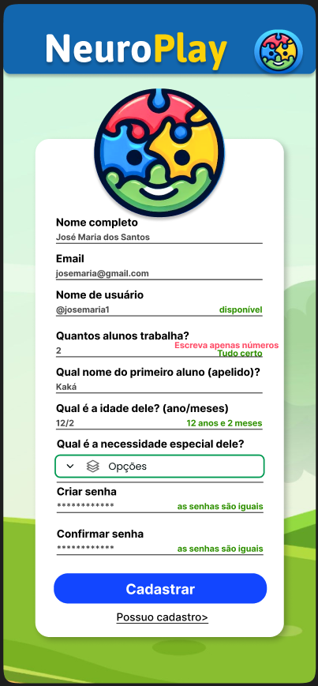

# 5. Interface do Sistema

Pré-requisitos: <a href="4-Projeto-Solucao.md"> Projeto da Solução</a>

_Visão geral da interação do usuário por meio das telas do sistema. Apresente as principais interfaces da plataforma._

## 5.1. Tela principal do sistema

_Homepage_

_Login_

_Selecionar qual o perfil a ser criado_

## 5.2. Telas do Profissional

_Tela para Cadatsro do Profissional._

## 5.3. Telas da Criança

_Indicar o e-mail_

_Indicar o diagnostico da criança_

_Indicar a idade da criança_

_Indicar o nome da criança_

## 5.4. Telas dos Niveis

_Descrição da tela relativa à atividade 1._

[`Tela da atividade 1`](images/)

_Descrição da tela relativa à atividade 2._

[`Tela da atividade 2`](images/)

## 5.5. Telas das Atividades

_Descrição da tela relativa à atividade 1._

[`Tela da atividade 1`](images/)

_Descrição da tela relativa à atividade 2._

[`Tela da atividade 2`](images/)

